# Production browser acceptance

Result: **PASS**

Application revision: `38292a53ce08cfaa865a530caf523b15b5419e5f`
Live target: https://xuan2261.github.io/Rocket-Anatomy-Lab/
Run: https://github.com/xuan2261/Rocket-Anatomy-Lab/actions/runs/36063253528

This checks deployed resources and real browser interactions against GitHub Pages. No local preview or mocked assets are used.

Cases: 28/28 passed; 0 failed.

**Physical Android/iOS: NOT YET VERIFIED.** Pixel 7 is Chromium emulation. No stable release is authorized by this result.

| Case | Status | Duration (ms) |
| --- | --- | --- |
| desktop-vi-base-assembly | PASS | 43271 |
| desktop-vi-lower-body-assembly | PASS | 38238 |
| desktop-vi-center-body-assembly | PASS | 18860 |
| desktop-vi-upper-body-assembly | PASS | 12381 |
| desktop-vi-nose-stack-assembly | PASS | 7612 |
| desktop-vi-guide-light | PASS | 5627 |
| desktop-vi-guide-dark | PASS | 5462 |
| desktop-en-base-assembly | PASS | 41439 |
| desktop-en-lower-body-assembly | PASS | 38082 |
| desktop-en-center-body-assembly | PASS | 16761 |
| desktop-en-upper-body-assembly | PASS | 12930 |
| desktop-en-nose-stack-assembly | PASS | 7567 |
| desktop-en-guide-light | PASS | 5079 |
| desktop-en-guide-dark | PASS | 5810 |
| mobile-emulated-vi-base-assembly | PASS | 45948 |
| mobile-emulated-vi-lower-body-assembly | PASS | 43205 |
| mobile-emulated-vi-center-body-assembly | PASS | 23342 |
| mobile-emulated-vi-upper-body-assembly | PASS | 15887 |
| mobile-emulated-vi-nose-stack-assembly | PASS | 12733 |
| mobile-emulated-vi-guide-light | PASS | 5455 |
| mobile-emulated-vi-guide-dark | PASS | 5668 |
| mobile-emulated-en-base-assembly | PASS | 45659 |
| mobile-emulated-en-lower-body-assembly | PASS | 41945 |
| mobile-emulated-en-center-body-assembly | PASS | 21509 |
| mobile-emulated-en-upper-body-assembly | PASS | 16256 |
| mobile-emulated-en-nose-stack-assembly | PASS | 12485 |
| mobile-emulated-en-guide-light | PASS | 5606 |
| mobile-emulated-en-guide-dark | PASS | 5407 |

## Resource identity
- before: 33/33 files byte-identical to the pinned revision/build.
- after: 33/33 files byte-identical to the pinned revision/build.

## Limitations
- Mobile is Chromium Pixel 7 emulation, not a physical Android device.
- No physical iOS, GPU/driver, pinch gesture or assistive-technology sign-off.
- Screenshots are unmasked observations; no new golden snapshots are accepted.

## Errors

## Unmasked screenshots
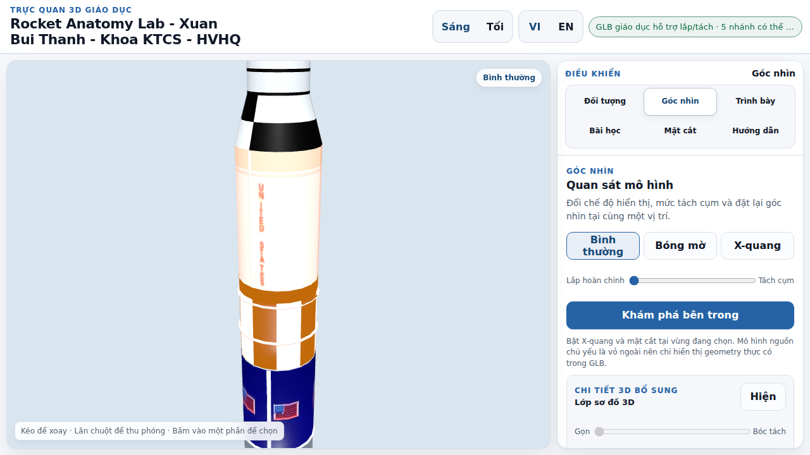
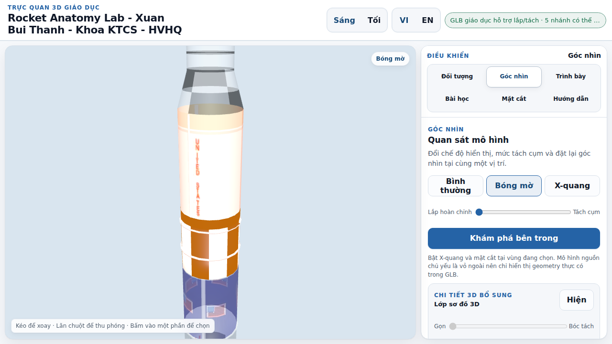
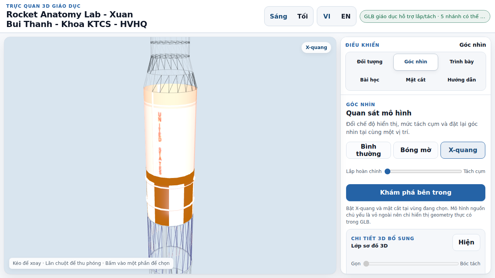
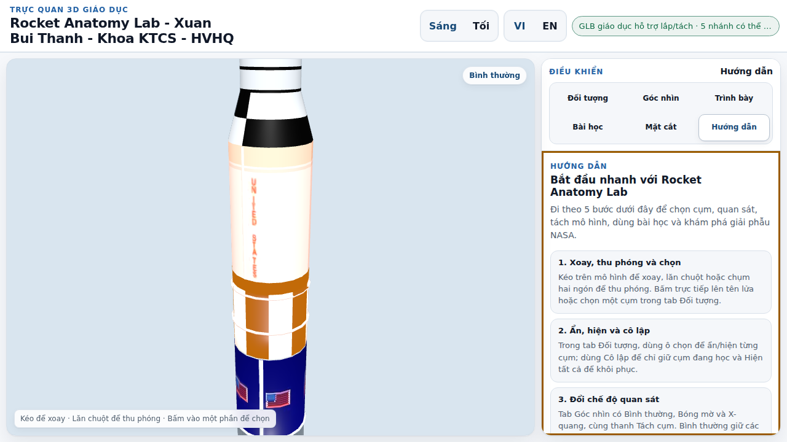
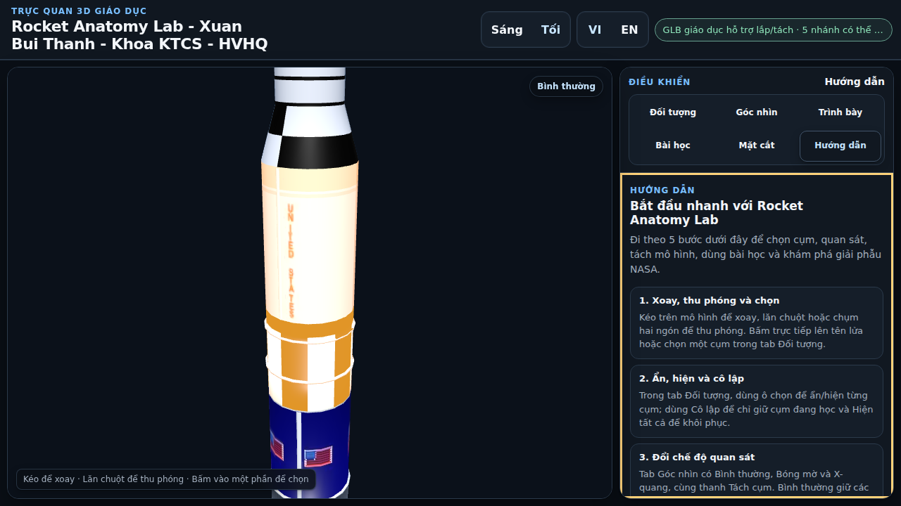
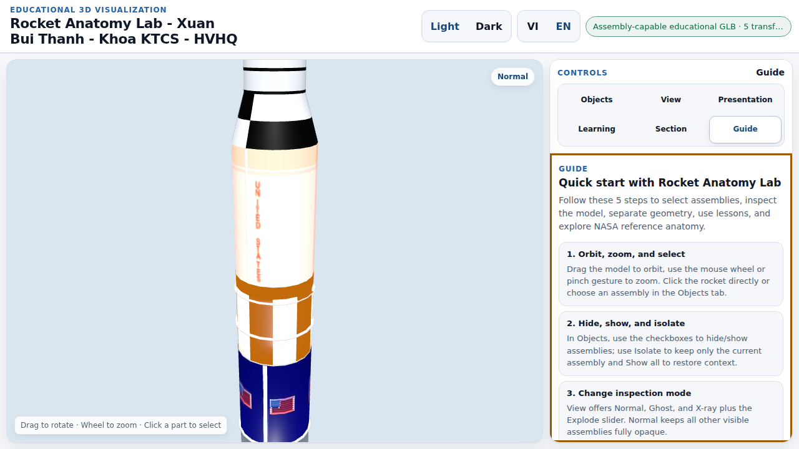
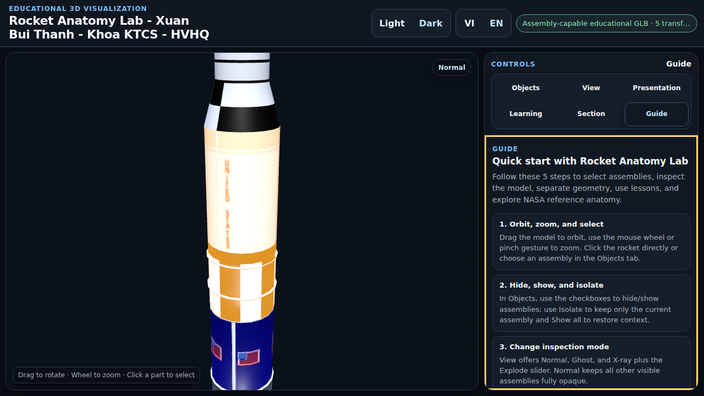
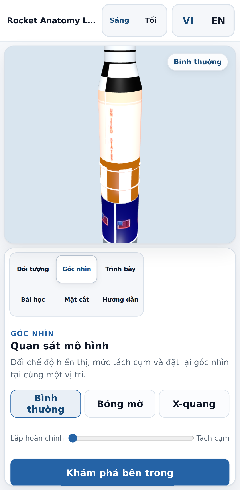
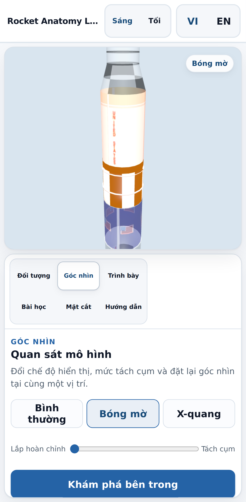
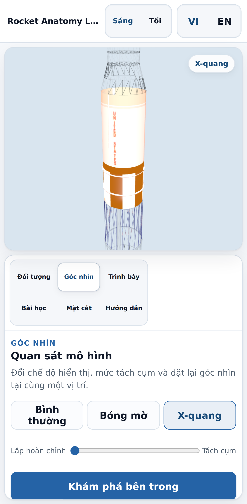
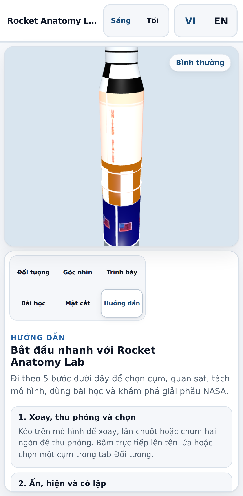
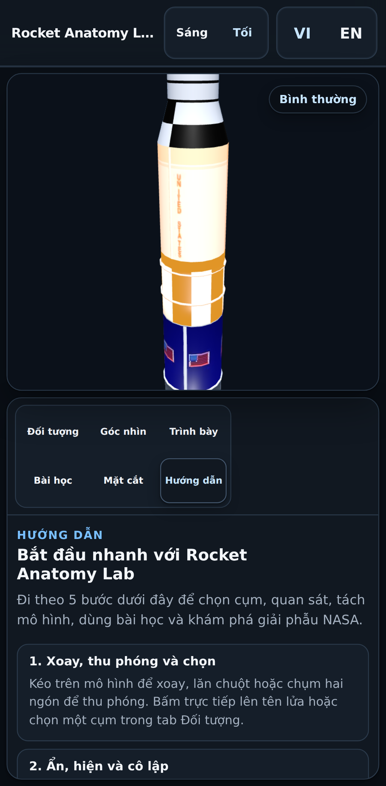
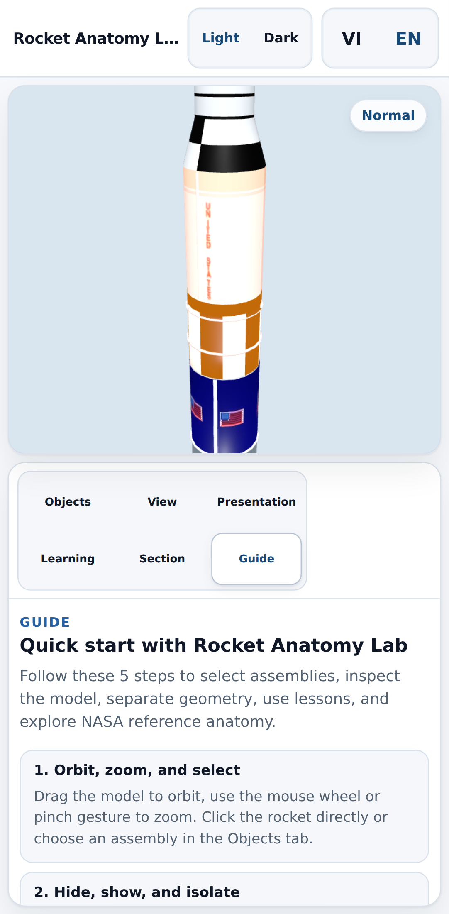
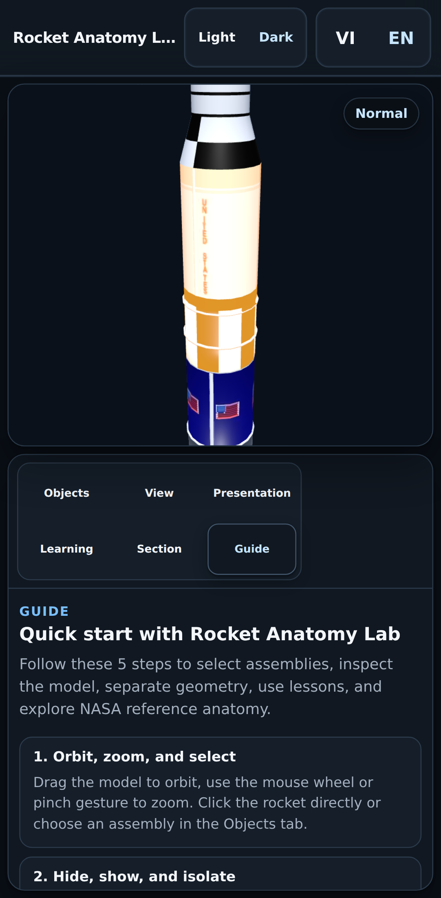
